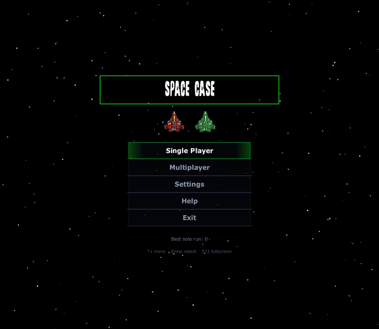
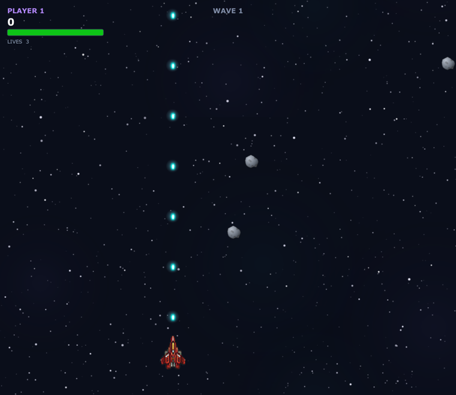
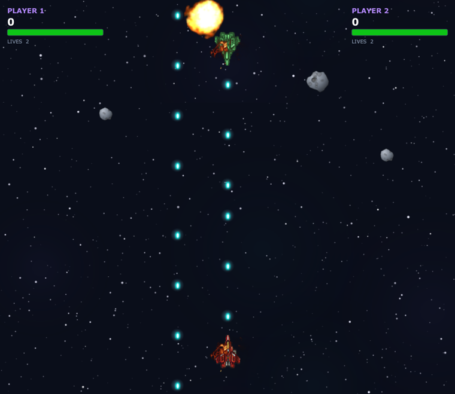
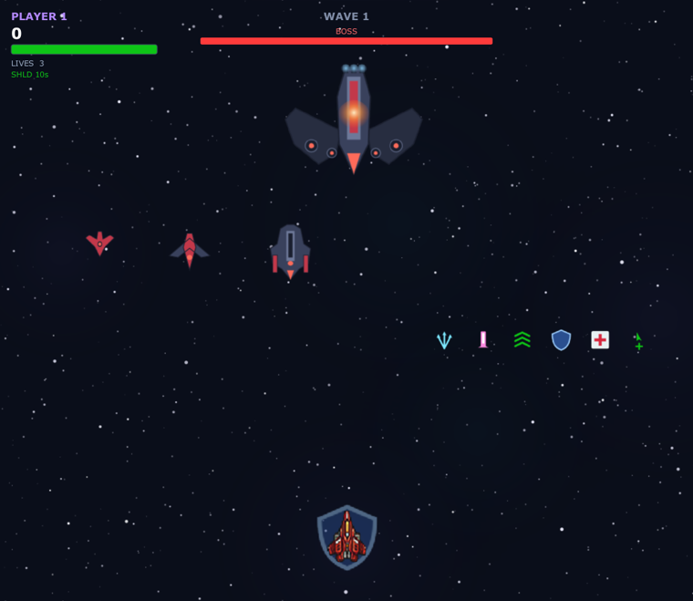

# Space Case

[](https://github.com/hashjaco/Space-Wars/actions/workflows/ci.yml)
[](LICENSE)
[](https://adoptium.net)
[](https://openjfx.io)

A 2D space shooter: fly, dodge asteroids, shoot up enemy ships, fight bosses — or turn on each other
in Battle mode. Two players share one keyboard.

Originally written as *Space Wars* to get comfortable before building a game engine from scratch.

<p align="center">
  
</p>

<p align="center">
  
  
</p>

## Installing it

Grab the one for your machine from [Releases](https://github.com/hashjaco/Space-Wars/releases) and
open it. Java is bundled — there is nothing else to install.

| | |
|---|---|
| macOS | `SpaceCase-*.dmg` |
| Windows | `SpaceCase-*.msi` |
| Linux | `spacecase_*.deb` |

The builds are unsigned, so the first launch needs a nudge past the gatekeeper: on macOS right-click
the app and choose **Open**; on Windows pick **More info** then **Run anyway**.

Already have a JDK 26? `java -jar space-case-<your-platform>.jar` from the same page skips the
installer.

## Running it from source

    ./mvnw javafx:run

The wrapper fetches the right Maven itself, so a [JDK 26](https://adoptium.net) is the only
prerequisite. On Windows use `mvnw javafx:run`.

If that stops at *Unable to locate a Java Runtime*, the wrapper cannot see your JDK. Check with
`java -version`. Homebrew's `openjdk` is keg-only and stays invisible to the system Java wrappers
until you link it:

    sudo ln -sfn /opt/homebrew/opt/openjdk/libexec/openjdk.jdk \
      /Library/Java/JavaVirtualMachines/openjdk.jdk

`brew install --cask temurin` registers itself and needs no such step. Either way, pointing
`JAVA_HOME` at the JDK also works.

JavaFX stopped shipping inside the JDK in Java 11, so `pom.xml` pulls it from Maven Central
(including the platform natives) and puts it on the module path. `javafx.version` tracks the JDK major
version — JavaFX 26 needs a JDK 26 runtime.

Other targets:

    ./mvnw test               # unit tests; no display, audio device or controller needed
    ./mvnw package            # target/space-case-2.0.jar
    ./mvnw package -Pshaded   # one self-contained jar for this platform

Installers are built by `jpackage`, which ships inside the JDK; the release workflow runs it once per
operating system.

## Modes

| Mode | Players | Enemies | Friendly fire | Ends when |
|---|---|---|---|---|
| Single Player | 1 | yes | no | you run out of lives |
| Co-op | 2 | yes | no | both players are out |
| Battle | 2 | none | **yes** | one player is left |

In Battle, player two starts at the top of the arena facing down, both players' shots hurt each
other, and asteroids and power-ups keep arriving as shared hazards and prizes.

## Controls

| | Move | Fire |
|---|---|---|
| Player 1 | `W` `A` `S` `D` | `SHIFT` |
| Player 2 | arrow keys | `,` |
| Any controller | left stick or d-pad | `A` / cross |

Single player accepts either WASD or the arrow keys, and fires with `SHIFT` or `SPACE`.
`ESCAPE` pauses, `F11` toggles fullscreen. Menus take the arrows or `W`/`S`, `Enter` to choose.

### Controllers

Pair a Bluetooth pad — DualSense, Xbox Wireless, Switch Pro and 8BitDo are all recognised — or plug
one in, and it works with no setup: menus included. The first pad plays as player one and the second
as player two, and the keyboard keeps working alongside them, so two people can share a pad and the
keys.

`Start` pauses. Settings has rows for the fire and pause buttons, the stick deadzone (raise it if a
worn stick drifts on its own) and an off switch. A pad going flat mid-game drops back to the keyboard
rather than leaving your ship drifting.

## Power-ups

Dropped by defeated enemies: tri-shot, mega laser, shield, health refill, speed boost, extra life.
The timed ones show a countdown in the HUD.

## Levels

Eight places, flown in order: **Orbital Approach** → **Verdant Airspace** → **Canopy Descent** →
**Rust Canyon** → **Undercity** → **Void Rift** → **Star Core** → **Escape Vector**. Each has its own
parallax sky, its own flagship, and its own faction of defenders — the two levels inside the planet's
air and jungle field organic hulls rather than the mechanical navy of open space.

Past the eighth the run loops back to the first with higher spawn pressure, so death is still the only
way it ends.

## Enemies

Scouts, fighters and cruisers arrive in waves that get tougher. A level's last wave brings its
flagship, which changes attack pattern as you wear it down — a wide spread, then a fan that sweeps
across the arena, then fast bursts aimed straight at you.

<p align="center">
  
</p>

## Between levels

Killing a flagship does not drop you straight into the next place. The surviving ships accelerate off
the top of the screen, then a debrief reports what the level cost you — kills, accuracy, damage taken,
lives lost, clear time — and pays the bonuses it earned: a flagship bounty, marksman, untouched,
unbroken, and swift for beating the level's reference time. Press any button and the game warps, which
is also when the next level's art is decoded in the background.

## Pilots and rank

Name both seats from **Pilots** on the start menu; the name shows under the ship. Level bonuses are
credited to a career total stored against that name, and the career total sets a rank on a
twenty-six-step ladder from Recruit to Fleet Marshal. Career progress is keyed by name rather than by
seat, so a pilot keeps their rank whichever side of the keyboard they take.

## Layout

```
src/main/java/com/hashimjacobs/spacecase/
  Main.java  Launcher.java  GameConfig.java
  scene/   SceneRouter and every screen (start, multiplayer, settings, help,
           pause overlay, game over) plus the menu widgets and navigator
  mode/    GameMode + ModeRules — what differs between the three modes, as data;
           Level — the eight places; Debrief — what clearing one pays
  engine/  GameLoop, FixedTimestep, World, CollisionSystem, Renderer, Hud,
           InputState, Gamepad, GamepadMapping, PadState, QuadTree,
           SpawnDirector, ShipController, EnemyWeapons, DebriefOverlay
  entity/  Entity, PlayerShip, EnemyShip, Asteroid, Bullet, PowerUp,
           Facing, BossPhase
  asset/   Assets + the Sprite / SoundFx / MusicTrack / Explosion enums, SoundBank
  prefs/   Settings, HighScores, Pilots, Rank and Standing, persisted via java.util.prefs
tools/     GenerateAssets.java — regenerates the art and audio
src/test/java/...   JUnit 5
```

Four invariants worth knowing before changing the engine, each of which was a bug once. They are
spelled out in [CONTRIBUTING.md](CONTRIBUTING.md); the short version:

- **`World` is the only place entities are added or removed** — collisions only mark, `sweep()`
  removes.
- **Sprites and sounds are enums, not string keys** — a missing asset is a compile error.
- **Simulation speed must not depend on the display** — the loop steps at a fixed 1/60 s.
- **Assets load from the classpath, not the working directory** — so the jar runs from anywhere.

## Soundtrack

Six original instrumental tracks. Which one plays is chosen by *cue* rather than fixed per screen —
gameplay and battle each rotate between two tracks, so replaying a mode does not always sound the
same, and a boss arriving swaps the music until it dies.

| Cue | When |
|---|---|
| `MENU` | Start screen, submenus, game over |
| `GAMEPLAY` | Single player and co-op |
| `BATTLE` | Battle mode |
| `BOSS` | While a boss is on screen |

Re-pointing a cue at different tracks is a one-line edit in `asset/MusicCue.java`.

## Assets

Every bundled file's origin is recorded in [ASSETS.md](ASSETS.md), and a test fails the build if that
drifts. The music is composed by the author; the art is either hand-drawn by the author or generated
by `tools/GenerateAssets.java`, which is committed and deterministic — `java tools/GenerateAssets.java`
reproduces it byte for byte, and CI checks that it still does.

No fonts are bundled; menu headings use whichever display face the host already has.

## Contributing

See [CONTRIBUTING.md](CONTRIBUTING.md). Bug reports and small fixes are welcome.

## Licence

[MIT](LICENSE) — code and assets alike.

The release jars carry two third-party runtimes: JavaFX ([GPLv2 with the Classpath
Exception](https://openjdk.org/legal/gplv2+ce.html)) and, for controller support,
[Jamepad](https://github.com/libgdx/jamepad) (Apache 2.0) with the copy of
[SDL](https://libsdl.org) (zlib) it wraps.
